# PA6 : Hidden-Markov Model
## James Fleming COSC 76 Dartmouth Fall 2020
### I collaborated with Sudharsan Balasubramanji we read through the pset together and discussed pseudo code. 

### Code Design
    For this problem set I chose to use the matrix model of the assignment. I used a reverse engineering process. The filtering algorithm with matrices was quite simple to write. I then worked backwards and wrote the correct methods to create the proper matrices that the filtering algorithm would take. 
    
#### filtering.py
    The main function of filtering is the filter method. It takes in a model object.
    The model class is defined in model.py. It is quite simple here. A model must have a prior matrix, a transition matrix, and an updateMatrixDictionary
    
    Filter takes in a sequence of observations and loops through each observation. From a dictionary of different update matrices it selects the corresponding update matrix for a given observation. The transition model is given by the generic model. To create a currentStateEstimate we use matrix multiplication to get out a column vector relating the propsed state to the probability that the system is in that state. In the case of umbrella it is rain or not rain. In the case of the robot each row represents a different position the robot could be in the maze. When filter runs for the first time the currentStateEstimate is just the prior assumption of the system. 

    For each new observation we add the distribution to a list called distributions. This allows us to see how the distributions change according to new observations

    We use a normalize method to normalize the probabilities in the stateEstimate vector. It simply makes sure all the probabilities add up to 1 as they should. 
#### RobotModel.py
    RobotModel extends the framework of the model class. The filter algorithm takes in a generic model object, but here in RobotModel we use problem specific guidelines to build the necessary parts of a model. 

#####   createPrior
        A robot's prior assumption of where it is is a uniform distribution of all the possible places in the maze. Simply loop through every position in the maze. If it is a wall give it probality 0 and if it is a floor spot give it probability 1/numFloor where numFloor is the number of floor spaces in the maze. This should return a column vector where every row corresponds to a different position in the maze
#####   createTransitionModel

        This needs to be a matrix where everyrow is a different position in the matrix and every column is a position in the matrix. For a 4x4 maze we get a 16x6 matrix relating all 16 positions a robot could currently be in to all 16 positions it could transition to.

        To build this matrix we go through every position in the maze (every row in our matrix). All positions we want to transition to (columns) get a 0 probability if they are not reachable in 1 move or are a wall. For every neighbor (reachable position) we give it a probability of .25. If a robot has x walls surrounding it the probability that it will not actually move because of these walls become .25 * x. Essentially the probability the robot wont move is the sum of the probabilities that the robot will move and hit a wall so be unable to change positions. 

        To calculate where a tuple position (x,y) is indexed in our matrix we use the equation index = x*self.maze.width + y. I keep this standard throughout the problem that the column vector of stateEstimates are built following the order (0,0), (0,1), (0,2) (0,3)(1,0).. for a 4x4 for example. Therefore we can see that the 5th position in the vector (index 4 ) (1,0) can be found with 1*4 + 0 = 4.

        I will use this simple algebra again throughout the problem

#####   createUpdateMatrixDictionary
        Given all the possible observable colors we need an entry in this dictionary for each color observed. Then when our sensor observes a certain color, this dictinoary can quickly retrieve the corresponding udpate matrix. 

        The update matrix itself is a numPosition x numPositions of the maze matrix. For instance a 4x4 maze has 16 positions so the update matrix is 16x16. Only diagnols will have information but the size is necessary so that the dimensions in the matrix multiplaction are correct. 

        To build a particular update matrix for a given color we create a 16x16  matrix. Every row corresponds to a position in the maze. Notice that all of our matrices have each row corresponding to the same position in the maze. This is important. I continually use the nested for loop of x across width then y across height to maintain consistent ordering. 

        We will use the data from the maze to ask what color is at a certain position. If the color at that position is the color we observed then the probability you observed that color from that position is 0.88. If the color observed is not the actual color at a certain position, then the probability you observed that color at that position is only 0.04. If you are at a wall there is no way you observed a color. 

        Remember to put all data at the diagnols so the matrix multiplication works out. 

#### RunRobot.py
    While RobotModel builds a model of the robot based on the maze, we need a decent amount of code to actually simulate running the robot. 

#####   RandomlyPlaceRobot. 
        If a initial position of the robot is not given we will randomly determine one using randomlyPlaceRobot. This method uses randrange to pick coordinates within the bounds of the maze. The intial position is know to the observer watching the robot, but the robot is never told where it started.

#####   GenerateMoves. 
        A user may hardcode a moves list and give it to RunRobot. Alternatively one might just want to say "make x moves" and have them be randomly generated by the program with a uniform distibution to move N,W,S,E as described in the problem.

        GenerateMoves will take a moveLimit and create a list of length moveLimit with moves marked by a string N,W,S,E. 

#####   generatecolorSequence
        generateColorSequence takes a list of moves and the intial position of the robot. It will then turn these moves into an actual path of positions from the initial position. It will also see where the robot is along this actual path and then use the robots sensor to generate a sequence of colors that a robot might recieve along the path. It uses the percentages outline in the problem. 0.88 For seeing the color the robot is actually on. 0.04 for seeing each other wrong color. 
    
#####   sensorReading
        generatecolorSequence calls upon sensorReading which is given a position and then gives back a color based on the probabilities described above. 

#####   displayDistributions
        Each distribution is a column vector but we want to turn this into a string matrix that corresponds to the string representation of the maze. This function simply prints a 4x4 matrix representation of the 16x1 column vector. It takes care to make sure the distributions match up to each position. 

#####   displayResults
        Here we set everything up and run it. This method calls the filter algorithm on a generated color sequence and passes the RobotModel in. Then we use a bunch of print statements to make sense of all the data coming out. We will print the direction the robot moved, where that move ended up, and the sensor reading after that move. Then we will print the maze and the corresponding  distribution of where the robot currently thinks it is in the maze

#### Maze.py
    I pulled some of the given Maze code from PA2 and then updated it so that the maze would now have every floor space be randomly colored. is_floor had to be changed to make sure it works still. 

### Testing and Results

    To begin, I hardcoded the necessary matrices of a model object based off of the information in the example problem. As a sanity check I ran my filter algorithm and got the same results we had from class.

    I tried to break up my code to make it easier to test. At the bottom of each file I have some informal testing code just to make sure my individaul methods were working as expected. A lot of this preliminary testing was printing out transition matrices or update matrices and making sure they made sense compared to the maze that they were built off

    The real testing is done by running RunRobot.displayResults

    This is done in testingPA6.py where you can run the problem as a grade. I will go through some random runs myself here.

    After seeing my runs it was clear that I was able to localize the robot with a few runs not working as well as others. Overall I believe all the algorithms are working and giving helpful data. I discuss possible reasons for variability below as well as the shortcomings of solely using the final probabilities as a metric of success. 

    In my opinion the test runs I did on a larger matrix show the effectiveness of my algorithms the best. Small mazes with only a few floors spaces colored in 4 colors provide a lot more variance of results. It is also hard to tell if the robot knows it general location or not. In large mazes even if the specific location is not the one with the highest probability it will be clear that the robot knows its general location.

    Here is the full run on maze1.maz with a moveLimit of 4
    We start at (3,0), we have the a uniform distribution across the places where there are not walls. Maze 1 has 3 walls so the probability of being at any given floor space is 1/(16-3) = 1/13 = 7.69

    We move S to (3,0) (we can't move south so we just stay where we are) and we read b which is an accurate reading. So far all this does it increase the probability we are on a blue square. So anywhere there is a blue square in the maze we see almost 30% probability of being there. This maze has only 3 blue spots so having an accurate blue reading is quite helpful

    Then we move north to (3,1) and again read accurately a blue. Now we it is thinking it is in the bottom right corner. While incorrect it is thrown off by the fact there are two blue squares right next to each other. Because that corner is surrounded by walls on 3 sides it thinks that it most likely just stayed where it was at (3,0)

    We move north again to (3,2) and get an accurate reading of G.
    The robot is not sure if it is actually at (3,2) or is at (2,2) which is also a green square right next to (3,1). Despite the uncertainty it has very high probability that it is at one of these spots

    Finally we move S back down to (3,1) and we read an accurate reading of b. Now the robot has a really good sense of where it is with 60 percent certainty it is at (3,1) which is where it actually is. The second highest probability is 24.83 percent right below at (3,0).

    I would call this a very accurate localization. The robot is quite sure it is somewhere in the bottom right of the map.
    It did however get lucky with accurate sensor readings as well as being on blue squares a lot of the time which were rarer in this particular maze. 

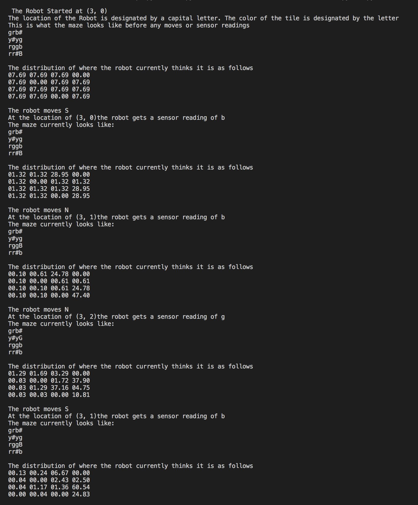

    I will look at some more results but not run through them entirely 

    After running on maze2.maz with a move limit of 10
    I got the following results
    On one run: we can see that we actually get a wrong sensor reading as our very last reading. This obviously hurts our results a lot. This was one of my worst runs

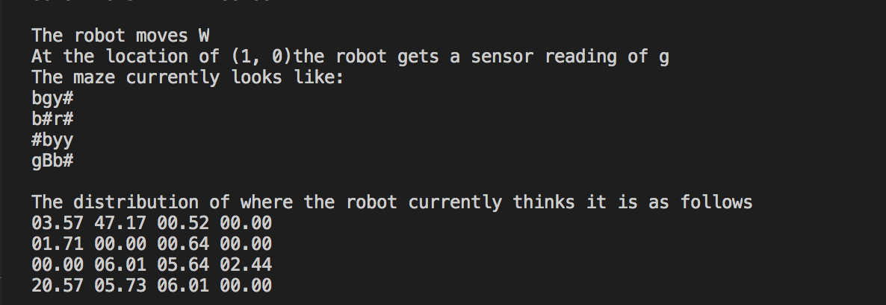

    On a different run of the same maze with 10 moves we can get some really accurate last results. 

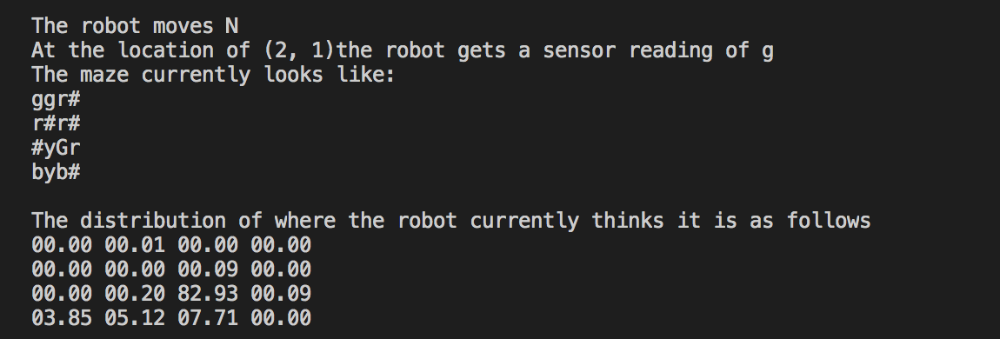

    I then changed my move limit to 100

    On one run I got

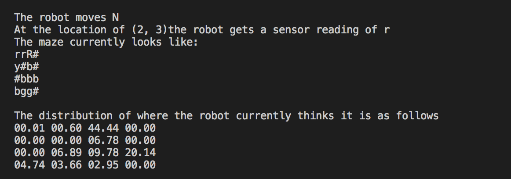

    On another run I get

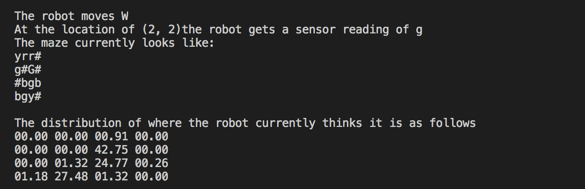

    In both cases we get accurate sensor readings as our last readings. In both cases The highest probability is at the position the robot is actually at. We see that even after 100 moves the certainty of actually being at that position is around 40% whereas other positions see much lower probabilities. However we notice that despite 100 moves we can not place our robot solely on the highest probability with much certainty. We would need to run viterbi on the robot as it moves to really try to figure out the path that has been taken. 

For these next runs I set the random seed to 1
I didnt want to change the actual coloring of the maze but just
change how many moves

Here I tried maze3 with 5 moves

With 5 moves we see that it is able to localize itself to the bottom right corner with the highest probability of 28.15 % being in the corner it actually is

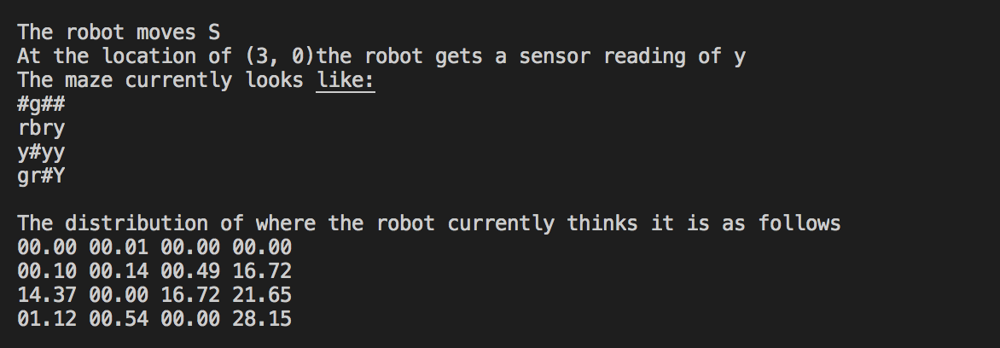

I then tried maze3 with 10 moves and as expected the probabilities are even more localized to the bottom right corner but it is unable to tell which of the four yellow squares it is in near that corner and incorrectly believe it is in the bottom right corner here. We have seen this before. When a robot is in a corner with only 1 way out it has trouble thinking that it is every out of that corner because the probability that it would stay in that corner is 75 percent

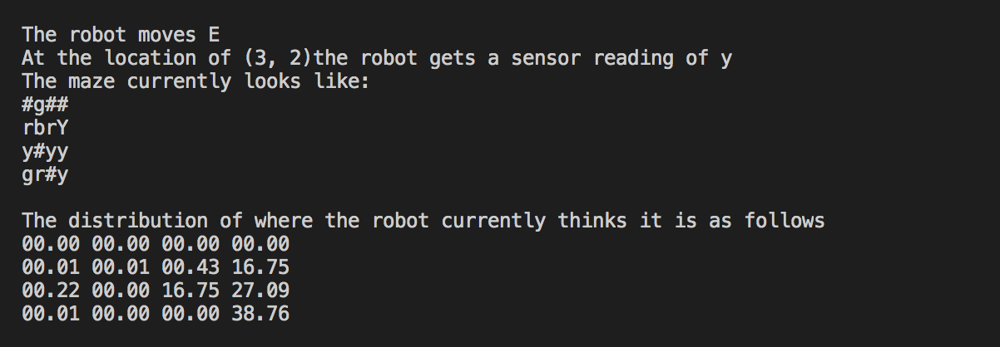

Finally I will try with 100 moves
Moving completely out of that corner it finds itself to be about 85 percent sure it is in the square it is actually in. There is a lot of luck here because there is only 1 blue square so when it gets an accurate reading of blue this helps it a lot. 
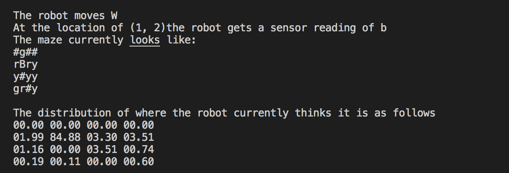

I will change the seed back to random and see what happens after 100 runs (the coloring of the map will change )

Here we get a wrong reading as our last sensor data convincing itself that it is at (3,1) when it is really at (3,0)
Despite this we still see that it is correct in identifying the general area 

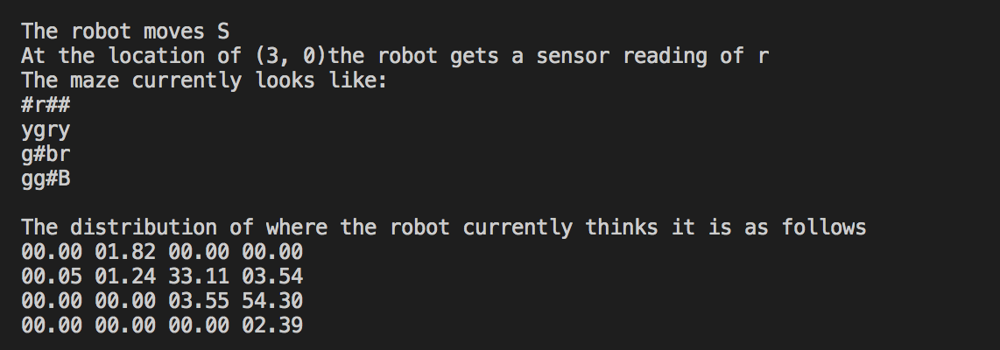

To really prove to myself that my algorithms were working I created a bigger matrix. I Realized that a bigger matrix would make the color become more uniform and give the robot some more space so we would have a better idea of if it can guess its general area not just a specific location. 

Running results on maze4 with higher move limits ranging from 100-500 gave really good results
I found that even if it could not localize to an exact point the robots general area was quite accurate.

Here is a really good run I had with almost 95 percent probability in the correct square and the second and third highest probabilities right next to it. This was with 300 moves
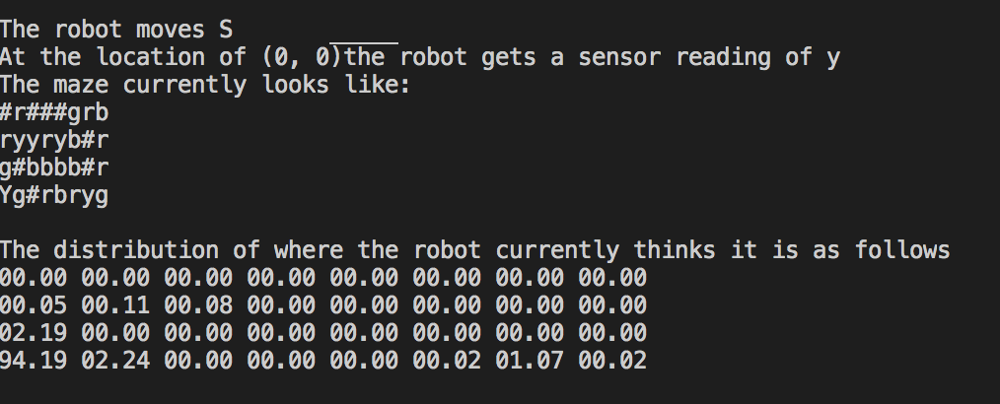

Here is a less good run where its not sure which yellow square it is in but again we see that it has clearly filtered off much of the maze and knows its general location. This was using 100 moves
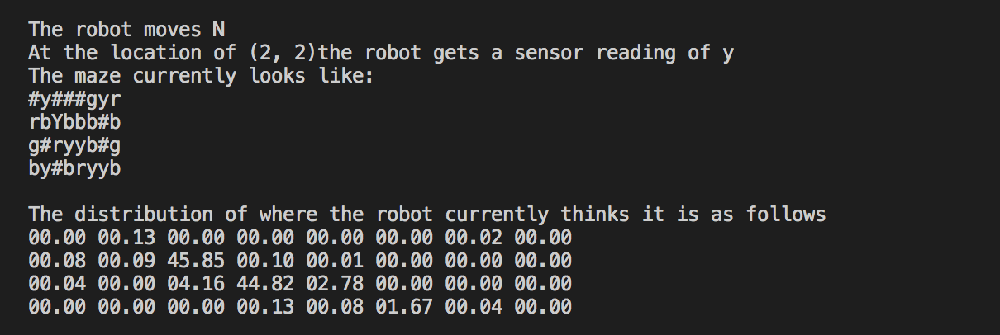

In fact it doesnt even need this many moves
After 10 moves on this big maze I was able to get a 82 percent probability in the correct location. 
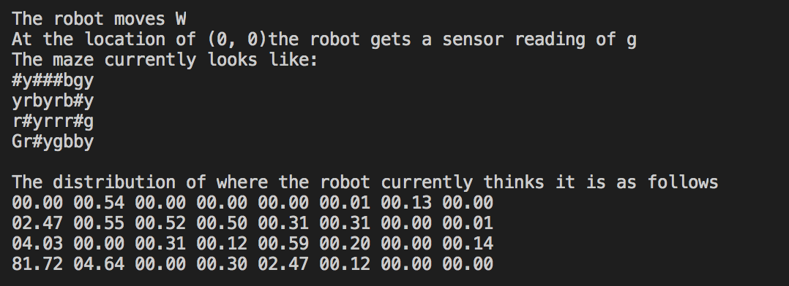

Again i got some cases where the last sensor reading was wrong but in a bigger matrix while this would confuse the robot on its specific location, its general location would still be right. 

#### Variance in results
    I believe that my results were correct and showed that the algorithms were working, but the setup of the problem can introduce great variance into results. None of this is fault of the code itself. 

    One thing I noticed after some testing is that accuracy of the robot's last distribution varies. We are not running viterbi on it to calculate most likely path so my metric for accuracy is just the distribution that is given after all the observations. Because the maze is randomly colored we get some mazes that are more diverse in terms of colors. Others will have one color more than another. If our last observation is a color of which appears a lot in the matrix, this will be harder to localize than landing on a color that appears in the maze comparatively little. If you generate many mazes you will see that the total number of each colored tile is uniformly dispersed but for one maze it will not be a perfectly uniform distribution. 

    Another aspect that varies the robots performance is how lucky it gets with the sensor. 
    Wrong sensor values will obviously hinder the robots performance. Again the probabilities are set but for real testing they will not always perfectly match. Therefore some runs will have better sensor output than others.

    Obviously a robot could never be on a wall so it will never think it is on a wall cause a wall has no color it is just a wall. Therefore the more walls in a maze the less positions the robot has to consider. 

    If there are a lot of the same colors in a maze that are near eachother a robot might not be able to tell which of the same colored squares it is on. I had multiple instances where there were many squares of the same color up against a corner so that robot had no way of knowing whether it was just sticking in the corner or moving away from the corner because all the sensor readings were the same. 

    Having the last sensor reading be wrong also hurt our precise location but did not ruin the general localization. 

   

